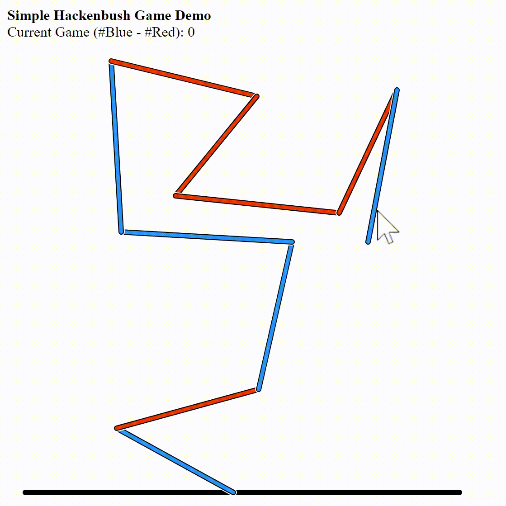

# Hackenbush
### Intro
- A Hackenbush involves two players to remove line segments on a graph. One player can remove blue lines while the other can remove red lines. If a line is deleted, all its children are also deleted. The player who removes the last line wins.

### Game Status
- Let each blue line have a positive unit score and each red line have a negative unit score.
- The summation of the scores defines a game's status.
- A game G have four states.
    - G>0: player picking the blue line can win
    - G<0: player picking the red line can win
    - G=0: 2nd player can win
    - G!>0,G!<0: 1st player can win
- The first three cases are covered in the demo. The fourth one is excluded because this case requires lines with another color.

### A Demo

### Demo Features
- The current game status is recorded on the top left.
- The winner is shown beside the game status.
- The first player can start by clicking on either a red or a blue line.
- The two players must make cut alternatively. If a red/blue line is cutted, the red/blue lines will be automatically disabled in the next turn. The blue/red lines are activated in the next turn.
- To randomly generate a new graph, refresh the page.

### Note
- This demo is not great for a real game play. A player can just cut the line near the black ground line.
- This demo is primarily for CSE 490H in UW.
